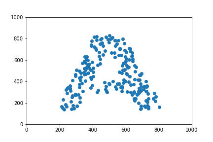

# Scatter-Letters
A script to write letters with Matplotlib's scatter plots, create transitions from one plot to the other and build a GIF.  
[Medium Article - Basics of GIFs with Python’s Matplotlib](https://towardsdatascience.com/basics-of-gifs-with-pythons-matplotlib-54dd544b6f30)  

## Why?
Because I tought it would be cool.  

## How?
It uses OpenCV to create a mask from an image, draw a plot filled with random x/y coordinates, and filter the points inside the mask.  
Then it uses Matplotlib to draw the plots and transitions and ImageIO to build a gif.  

## How to use
get_masked_data() - Create a list of random x/y coordinates and uses an image/mask to filter them.  
text_to_data() - Transform a text into a list of lists with the previous method.  
build_gif() - Uses lists of coordinates to build the scatter plots and the transitions, then save the result in a gif.  

## Creating plot with a new image

- Save a .png file with a mask at images/letters.
- The image should be 1000x1000 pixels.
- The mask should be black with a white background. See the example below.
- Run get_masked_data() with the name of the .png file and the desired intensity

### Example:

     

Image at `images/letters/A.png`  
`x, y = get_masked_data('a', intensity = 2)`  
`plt.scatter(x, y)`  
`plt.xlim(0, 1000)`  
`plt.ylim(0, 1000)`  
`plt.savefig('example.png') `

